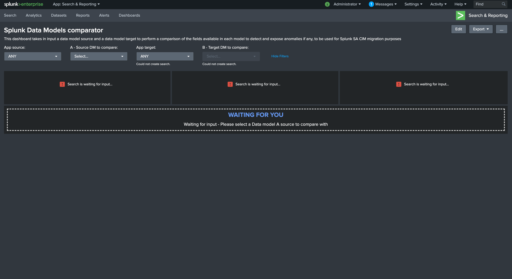

# Splunk-SA-CIM-in-docker-upgrade
Docker based workflow to compare and upgrade Splunk SA CIM data models

## Purpose
This is a simple toolset to help with upgrades of the Splunk SA CIM package especially.

The main challenge with upgrading the Splunk CIM resides in the local copy of the datamodels.
While the Splunk default/local approach prevents the upgrade from affecting the datamodel and results that would rely on it, it also defeats the purpose of a software upgrade as one will keep using a local copy, potentially out of date or missing important changes.

You can use this worflow based on a Docker machine approach for a cleaner, simpler, portable and more effiscient process, follow these steps.

## Requirements

- Clone this Git repository

- Make sure you have Docker and docker-compose ready:

https://docs.docker.com/engine/install/

https://docs.docker.com/compose/install/

- Choose where to run this, this can your laptop, a temporary Cloud instance or whatever.
In the vaste majority of the case you will want to replay the customisations you might require of the data models applied against the latest versions from the CIM package.

### Step 1: get your current app

Retrieve your current Production copy of the Splunk_SA_CIM and copy it to:

```
01-source-CIM/Splunk_SA_CIM
                           /default
                           /local
                           ...
```

This is expected to be the true copy of the app on the search head, including the local version of the DMs as seen by the search heads.

### Step 2: copy the target

Retrieve the Splunk_SA_CIM package target as a tarball archive, example:

```
02-target-CIM/Splunk_SA_CIM-4.18.0-1.tgz
```

### Step 3: start Docker

If you use VScode, then right click on the docker-compose.yml and start.

Otherwise, you can run:

```
docker-compose up -d
```

Very quickly, Splunk is up and running, listening on:

https://localhost:8000

- login: admin

- password: ch@ngeM3

### Step 4: exec in the container

Open a terminal within the container:

```
docker-compose exec --user splunk splunk /bin/bash
```

### Step 5: update the CIM app

```
cd /opt/splunk/etc/apps
tar -xvzf /tmp/02-target-CIM/Splunk_SA_CIM-4.18.0-1.tgz
```

*note: this patch is mounted automatically on the container*

### Step 6: run clone.sh

Run this simple shell script, it will move the local DM to a suffixed JSON file name and update local copies from default.
In the end, the CIM DMs are fresh and new based on the new version, your local copies remain available for the further steps.

```
 /tmp/01-source-CIM/clone.sh
```

Execution example, each DM existing in local will be handled:

```
[splunk@splunk apps]$ /tmp/01-source-CIM/clone.sh
Alerts.json done
Authentication.json done
Change.json done
Endpoint.json done
Intrusion_Detection.json done
Network_Resolution.json done
Network_Sessions.json done
Network_Traffic.json done
Web.json done
```

### Step 7: restart

```
/opt/splunk/bin/splunk restart
```

### Step 8: Open the comparator dashboard, qualify your changes, and replay

Open the provided dashboard in the search app **Splunk Data Models comparator**:



- On the left dropdown, select the builtin version of the data model, for example **Alerts**
- On the right dropdown, select the local suffix version, this is your existing copy priorir to the upgrade (but renamed)


The dashboard investigates both data models to highlight differences and anomalies, review the failures, replay your customizing in the Data model editor UI until you are happy with the definition.

### Step 8: finally package

Finally, you can package your new version of the CIM app, if you use source control such as Git, this is your package to be commited.

```
cd /opt/splunk/etc/apps
tar -cvzf /tmp/04-out-package/Splunk_SA_CIM.tgz
```

Deploy this package in your environment and continue your further validation workflow.
